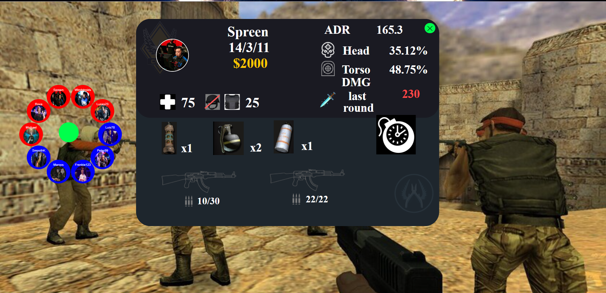

# Glance Value

## Description
GlanceValue is an application that visualizes real-time statistics of players on a gaming team. It allows users to quickly understand player statistics and make real-time strategic decisions during gameplay.

## Inspiration
The inspiration behind GlanceValue arose from the need to provide a more interactive and visually appealing way to represent player data in a game. We aimed to create a unique user experience that enables users to instantly access information about their teammates and opponents.

## Features
- Real-time visualization of player statistics.
- Intuitive and attractive user interface.
- Customizable organization of player bubbles.
- Integration of real-time data from an external server.

## How It Works
- Clone this repository to your local machine.
- Install the necessary dependencies using `npm install`.
- Run the application using `npm start`.
- Open your web browser and go to `http://localhost:3000`.

## Technologies Used
- React.js
- Axios
- react-draggable

## Screenshots
| Screenshot : Glance Value App Screen |
|--------------|
|  |

## Contribution
If you would like to contribute to this project, follow these steps:
1. Fork the repository.
2. Create a new branch (`git checkout -b feature/new-feature`).
3. Make your changes and commit (`git commit -am 'Add a new feature'`).
4. Push your changes to the repository (`git push origin feature/new-feature`).
5. Open a pull request on GitHub.

## Authors
- [Eduardo Martinez](https://github.com/ed-mart-r) - Lead Developer
- [Paul Avila](https://github.com/paul48avila) - Developer
- [Jose Cerna](https://github.com/luisc68) - Developer

## License
This project is licensed under the MIT License. See the [LICENSE](LICENSE) file for more details.

